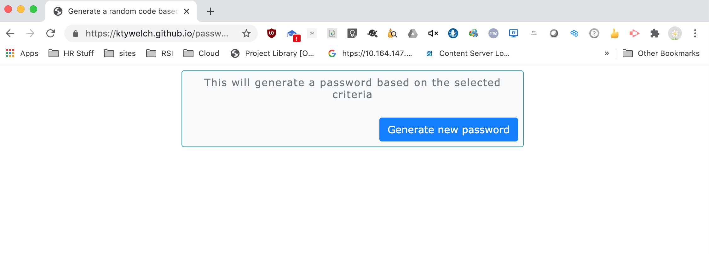
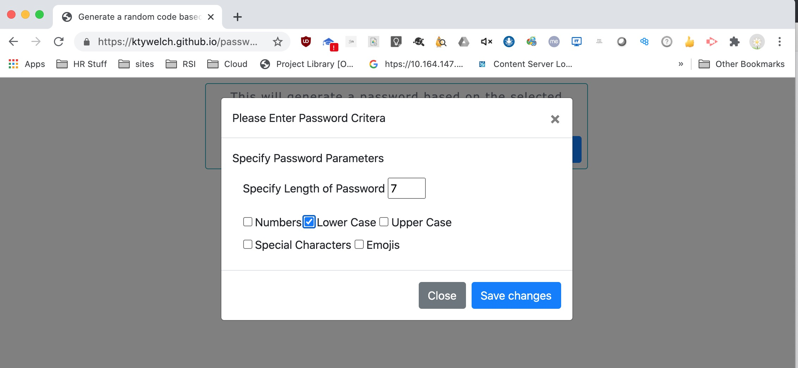
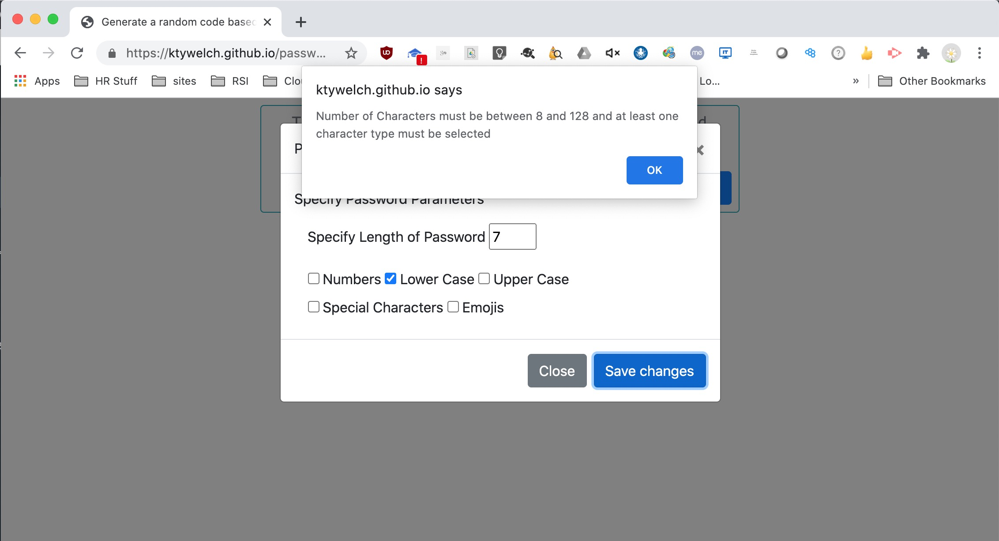
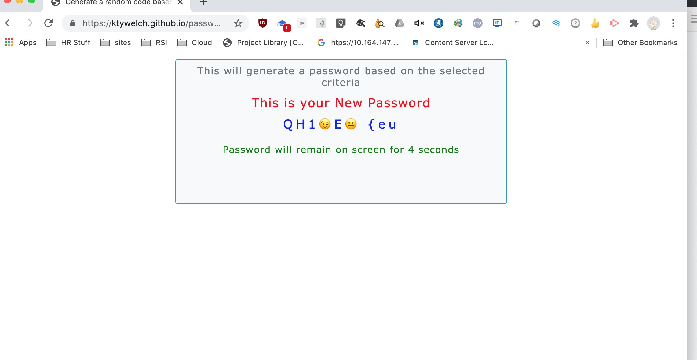

# Introduction
The assignment for homework2 is to create a web application tha utilizes the bootstrap 4 stylesheets to create responsive design ensures that web applications render well on a variety of devices and window or screen sizes.

## Table of contents
* [General info](#general-info)
* [Technologies](#technologies)
* [Setup](#setup)
* [User Guide](#user-guide)
* [Credits](#credits)

## General info
This object of this assignment is to generate a random password 
based on users input criteria and return the value to user. 

Use case was defined:

AN employee with access to sensitive data
I WANT to randomly generate a password that meets certain criteria
SO THAT I can create a strong password that provides greater security

	
## Technologies
Project is created with:
* Bootstrap version: 4.4.1
* Node JS version: v12.18.4
	
## Setup
To run this project, install is a simple download and extraction of the site and access to the internet is required 
the code relies on bootstrap style sheet and assoicated java scripts.

## User Guide
The application has a button to request a password as shown below

The user is then prompted for the criteria. This uses a modal form from bootstrap css so the main form fades 
as the input form comes to foreground. To submit the form user clicks the "Save Changes" button.

If the criteria does not meet the criteria the user will get a pop-up as defined in requirements:

The user will be returned to the form and prompted to try again.

When the user enters the correct criteria and clicks on the "Save Changes" button.

If the criteria are correct the password is displayed for the user for 4 seconds.

After which time the user is returned to the main screen.

## credits
Much of the code used in this project was copied from the bootstrap 4 samples and W3C 
sample documents. Adjustments were made to make the code work.

Peer review by study group: Lucah, Franco, Eva

Code Validated by https://validator.w3.org/

